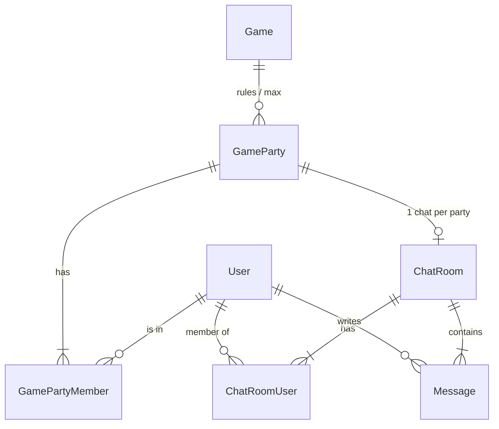

# Matchmaking, lobby (party) et chat — notes de conception

Ce document regroupe une discussion de conception (archive Cursor) sur le backend chat, le matchmaking, l’entité type **session / lobby / party**, le flux **prêt → prêt à discuter → chrono → ouverture du chat**, et une organisation front / back suggérée.

**À vérifier dans le code** : chemins de fichiers, URLs et modèles peuvent évoluer ; croiser avec le dépôt actuel.

---

## 1. Où est le chat dans le backend

- **App Django** : `backend/apps/chat/` — modèles `ChatRoom`, `ChatRoomUser`, `Message`, vues REST, consumer WebSocket.
- **Routes HTTP** : incluses sous `api/` via `backend/config/urls.py` → `apps.chat.urls`.
- **WebSocket** : `backend/config/routing.py`, branché dans `backend/config/asgi.py` avec le middleware JWT (`backend/apps/realtime/middleware.py`).

### REST (HTTP)

- **Historique / création de messages** (il faut déjà connaître l’id du salon) :
  - `GET /api/chats/<room_id>/messages` — historique paginé (pagination globale du projet, typiquement 10 par page).
  - `POST /api/chats/<room_id>/messages` — corps JSON : `{"content": "..."}`.
- **Auth** : comme le reste de l’API — utilisateur **authentifié** et **membre** du salon (`ChatRoomUser`), sinon 403 / 404 selon le cas.

### WebSocket (temps réel)

- **URL** : `ws://<hôte>/ws/chat/<room_id>/` (en production souvent `wss://...`).
- **Auth JWT** : query string `?token=<JWT>`, et/ou cookie `access_token` (aligné avec le REST si cookies).
- **Envoyer un message** : JSON `{"type": "message", "content": "le texte"}` (contenu non vide).
- **Réception** : payload avec notamment `id`, `room_id`, `user_id`, `content`, `created_at` (voir `consumers.py`).

### Point important pour le front

Il n’y a **pas** d’endpoint REST dans ce module pour **créer un salon** ou **lister les salons** : seules les routes `.../messages` existent. Les `ChatRoom` / `ChatRoomUser` se gèrent aujourd’hui surtout via **admin Django**, fixtures, shell, ou **futures routes métier**.

Les **notifications** temps réel passent par un autre canal WebSocket (`NotificationConsumer`, ex. `ws/notifications/`), pas par le chat.

---

## 2. Peut-on « créer un chat » depuis le frontend ?

**Avec l’API exposée aujourd’hui : non** pour la création du salon.

- Seuls `GET` / `POST` sur `/api/chats/<room_id>/messages` existent : cela suppose un **`ChatRoom`** déjà créé et l’utilisateur déjà **membre**.
- Créer le salon et y ajouter des utilisateurs n’est pas prévu dans les URLs du module `chat` sans développement supplémentaire.

### Pistes d’évolution (MVP)

Les briques modèles + WS existent ; il manque surtout des **vues REST** et de la logique métier, par exemple :

1. **Créer / retrouver** une conversation (ex. `POST /api/chats/direct` avec `{"other_user_id": ...}`) avec logique **get-or-create** pour éviter les doublons.
2. **Lister les salons** de l’utilisateur (ex. `GET /api/chats`).
3. **Tests** sur ces endpoints.

Ordre de grandeur (indicatif) : **½ journée à 2 jours** selon finitions (pagination, dernier message, doc OpenAPI, garde-fous).

---

## 3. Chats liés au matchmaking (plusieurs joueurs)

### État envisagé dans la discussion

- **Matchmaking** (`apps/matchmaking/`) : `MatchmakingRequest`, `GET /api/matchmaking/matches/` pour des **candidats** — ce n’est pas forcément une « partie » figée avec un id commun.
- Un modèle **`Match`** peut exister (ex. deux joueurs) ; pour **N > 2**, il faut souvent un modèle **N joueurs** ou une entité **party**.

- **Chat** : salons **`direct`** ou **`group`** côté modèle ; en pratique le code vérifie surtout l’appartenance (`ChatRoomUser`), pas une logique très différente par type.

Pour « plusieurs users prêts → un chat », il faut un **id stable de groupe** et des **règles** (qui crée le salon, quand, qui peut entrer) :

- Créer un **`ChatRoom`** en mode groupe, des **`ChatRoomUser`** pour chaque participant.
- Option utile : **lien** `ChatRoom` ↔ entité **session / lobby / party** (FK) pour éviter ambiguïté et doublons.

---

## 4. État actuel des types de salon et des permissions

### Types (`ChatRoom`)

| Valeur    | Rôle |
|-----------|------|
| `direct`  | Défaut dans le modèle ; souvent pensé pour deux utilisateurs. |
| `group`   | Salons multi-personnes ; peu de distinction dans les vues / WS. |

**Comportement** : membre du salon (`ChatRoomUser`) ⇒ accès historique, POST, WebSocket ; sinon refus.

### API HTTP (résumé)

- `GET/POST /api/chats/<room_id>/messages` uniquement (pas de création de room, liste, invitation, etc. côté API publique).
- Le modèle **`MessageRead`** peut exister sans être exposé en REST.

### WebSocket (résumé)

- Connexion refusée si non authentifié ou non membre (codes type 4401 / 4403).
- Messages persistés en base comme un `Message` normal.

### Notifications

À la création d’un `Message` (REST ou WS), des notifications peuvent être envoyées aux **autres** membres du salon.

### Synthèse « qui peut quoi »

| Qui | Peut faire |
|-----|------------|
| Membre du salon | GET messages, POST, WS, envoi temps réel |
| Connecté, non membre | Rien sur ce salon |
| Anonyme | Rien |
| Staff / admin | Gestion via admin Django |

---

## 5. Entité session / lobby / party

**Une seule idée métier** : « cette rencontre de jeu » avec **id stable**, **membres**, **cycle de vie**, souvent **séparée** du simple fil de messages.

Sans ça, on a des `MatchmakingRequest` et des candidats, mais pas toujours de réponse claire à :

- à quel moment ces N personnes forment **un** groupe produit ;
- qui peut ouvrir le chat ;
- fin / annulation / archivage.

### Rôle du pivot « party »

| Rôle | Détail |
|------|--------|
| Identité du groupe | Id partagé (partie #42), pas seulement une room sans contexte. |
| Qui est dedans | Membres acceptés / prêts (`PartyMember` ou équivalent). |
| Règles métier | Jeu, **max de places**, statuts (`forming`, `ready`, …), dates d’expiration. |
| Lien chat | FK `party` → `ChatRoom` ou `chat_room_id` sur la party. |
| Lien matchmaking | Les requêtes = **découverte** ; la party = **résultat** du regroupement. |

**Lobby** : souvent la phase avant le lancement. **Party** : groupe formé. **Session** : terme parfois générique pour toute la durée de vie.

Tu peux **fusionner** conceptuellement room + métadonnées jeu, mais beaucoup d’équipes **séparent** cycle de vie « partie » et canal « discussion ».

---

## 6. Organisation idéale front / back (matchmaking → groupe → chat)

### Backend : trois couches

**A. Découverte** — `MatchmakingRequest` + liste de candidats (ex. `GET /api/matchmaking/matches/`).

**B. Partie / lobby (pivot)** — ex. `GameParty` + `GamePartyMember` :

- `game`, `max_players`, `status`, dates optionnelles ;
- membres avec flags **`ready`**, **`ready_for_chat`** si double validation.

**C. Chat** — `ChatRoom` + `ChatRoomUser`, lié fortement à la party (OneToOne ou FK).

Création idéale en **transaction** : party finalisée → room → `ChatRoomUser` pour les membres autorisés.

API typique à ajouter en plus des messages :

- `POST` pour créer / confirmer le groupe → réponse `{ party_id, chat_room_id }` ;
- `GET` détail party / « ma party active » pour l’écran lobby.

### Flux métier (end-to-end)

1. Lancer le matchmaking (POST requête).
2. Poll ou événements sur les candidats.
3. Action « créer / rejoindre partie » → POST backend : vérif jeu + plafond, crée ou met à jour party + membres + chat, renvoie `chat_room_id`.
4. Navigation vers écran lobby / chat avec `room_id` **fourni par l’API** (ne pas inventer côté client).
5. `GET /api/chats/<room_id>/messages` + WebSocket chat.
6. Fin : `PATCH` party `closed` ; produit décide si le chat reste en lecture seule, etc.

### Frontend : découpage suggéré

| Morceau | Responsabilité |
|---------|----------------|
| `MatchmakingContext` (ou hook dédié) | Recherche, candidats, polling, annulation — **sans** WebSocket chat. |
| `PartyContext` ou état de route | `partyId`, `roomId`, membres, statut, « prêt » / « quitter ». |
| `usePartyChat(roomId)` | Première page de messages, WS, merge des messages entrants. |
| Pages | Ex. `PartyLobbyPage` + `PartyChatPanel`. |

REST centralisé (`api.ts`) ; petits modules `services/party.ts` / `services/chat.ts` possibles.

**Sécurité** : la source de vérité pour « qui est dans le salon » = **membres de la party** (ou règle serveur équivalente), pas une liste d’ids arbitraires non contrôlée envoyée par le client.

---

## 7. Placement dans les groupes (rayon, max par jeu)

Logique discutée :

1. Filtrer les parties éligibles : même jeu, zone / critères, statut ouvert aux arrivées, `count < max`.
2. Aucune → **créer** une nouvelle party.
3. Une seule avec place → **y assigner** l’utilisateur.
4. Plusieurs avec place → choisir une **règle**.

### Plusieurs groupes avec de la place

Ça peut arriver **souvent** (pics, week-ends). Stratégies :

| Stratégie | Effet |
|-----------|--------|
| Plus ancien (FIFO) | Remplit d’abord un lobby — prévisible. |
| Random | Peut fragmenter en petits groupes. |
| **Le plus plein d’abord** (`max - current` minimal) | Souvent le meilleur pour « remplir et partir » — moins de lobbies fantômes. |

**Recommandation** : **remplir d’abord** — parmi les éligibles, prendre celui avec le **plus de membres** ; à égalité, le **plus ancien** ; le hasard peut servir de **tie-break** optionnel.

**Technique** : assignation **atomique** — transaction + **`SELECT … FOR UPDATE`** sur la ligne de la party (ou compteur verrouillé) pour éviter deux requêtes sur le **dernier slot** et dépasser `max`.

---

## 8. Double validation : `ready` puis `ready_for_chat` + chrono serveur

- **`ready`** : validation « on forme / on valide le groupe » (lobby).
- **`ready_for_chat`** : consentement explicite pour ouvrir la discussion.

**Chrono** : stocker sur la party par exemple **`countdown_ends_at`** (et éventuellement `countdown_started_at`) quand **tous** ont `ready_for_chat`. Le client affiche `remaining = ends_at - now` en se calant sur l’**heure serveur** (champ JSON, header `Date`, etc.) — la **vérité métier** reste côté serveur à l’échéance (lazy check, Celery beat, etc.), pas uniquement `setTimeout` navigateur.

Si quelqu’un **retire** son prêt, **quitte** ou se **déconnecte** pendant le countdown : **annuler** le countdown côté serveur (statut, `countdown_ends_at` null, flags selon règles).

À la fin (serveur, idempotent) : créer **`ChatRoom`** si absent, **`ChatRoomUser`**, lier la party, statut type **`chat_open`** / **`chat_active`**, exposer `room_id`.

---

## 9. Entités et relations (vue d’ensemble)

| Entité | Rôle |
|--------|------|
| `Game` | Jeu ; `max_party_size` ou équivalent. |
| `MatchmakingRequest` | « Je cherche » ; peut être fermée / liée une fois assigné à une party. |
| `GameParty` | Groupe : jeu, statut, max, `countdown_ends_at`, lien optionnel vers `ChatRoom`. |
| `GamePartyMember` | `user`, `party`, `ready`, `ready_for_chat`, dates join/leave. |
| `ChatRoom` / `ChatRoomUser` | Discussion ; alignés sur les membres autorisés à l’ouverture. |
| `Message` | Inchangé une fois le salon actif. |

### Exemple de statuts `GameParty`

| Statut (exemple) | Signification |
|------------------|----------------|
| `open` | Accepte encore des joueurs (sous le max). |
| `full` | Optionnel — max atteint ou fermeture des entrées. |
| `waiting_ready` | Attente `ready` pour tous. |
| `waiting_ready_for_chat` | Tous `ready` ; attente `ready_for_chat`. |
| `countdown` | Tous `ready_for_chat` ; `countdown_ends_at` défini. |
| `chat_active` | Chat ouvert. |
| `cancelled` / `expired` | Abandon ou timeout. |

---

## 10. Flux d’actions (ordre logique)

1. **Entrer en matchmaking** — création / mise à jour `MatchmakingRequest`.
2. **Placement atomique** — transaction, verrou, règle « plus rempli puis plus ancien » ; `INSERT` party + membre ou `INSERT` membre sur party choisie.
3. **`ready`** — membre met à jour ; quand tous actifs ont `ready` → transition vers l’étape « prêt à discuter ».
4. **`ready_for_chat`** — quand tous `true` → `countdown` + `countdown_ends_at`.
5. **Pendant le countdown** — UI locale ; annulations gérées côté serveur.
6. **Fin countdown** — création idempotente `ChatRoom` + `ChatRoomUser`, lien party, statut chat actif.
7. **Messages** — REST / WS existants ; notifications inchangées si déjà branchées.

### Cas limites (rappel)

- Départ / retrait de prêt pendant countdown → annuler chrono et recalculer conditions.
- Expiration du lobby sans prêts.
- Ne pas recréer deux fois le même chat si `chat_room_id` déjà défini.

---

## 11. Effort global (rappel)

- **Endpoints direct + liste de salons** : relativement court si schéma inchangé.
- **Matchmaking → party → chat N joueurs** : plus de travail sur **modèle**, **sécurité**, **états** et **API** ; c’est le cœur du produit décrit ici.

---

*Document généré pour remplacer l’accès direct à une conversation Cursor archivée ; le dépôt reste la référence pour l’implémentation exacte.*
